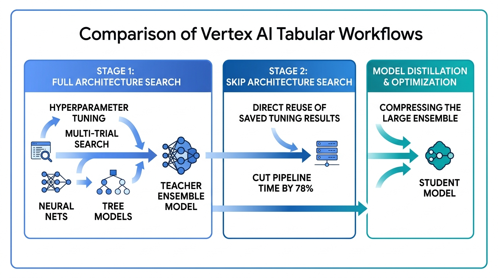
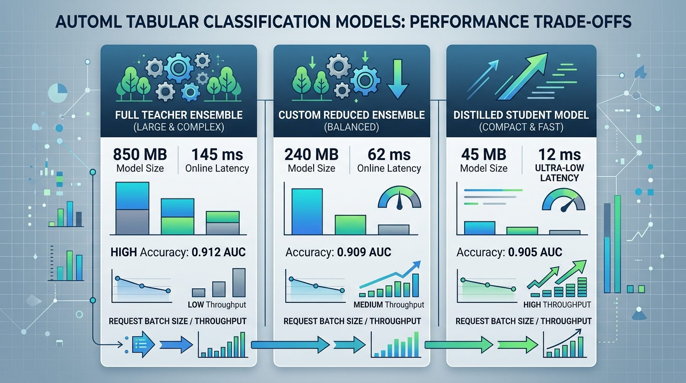
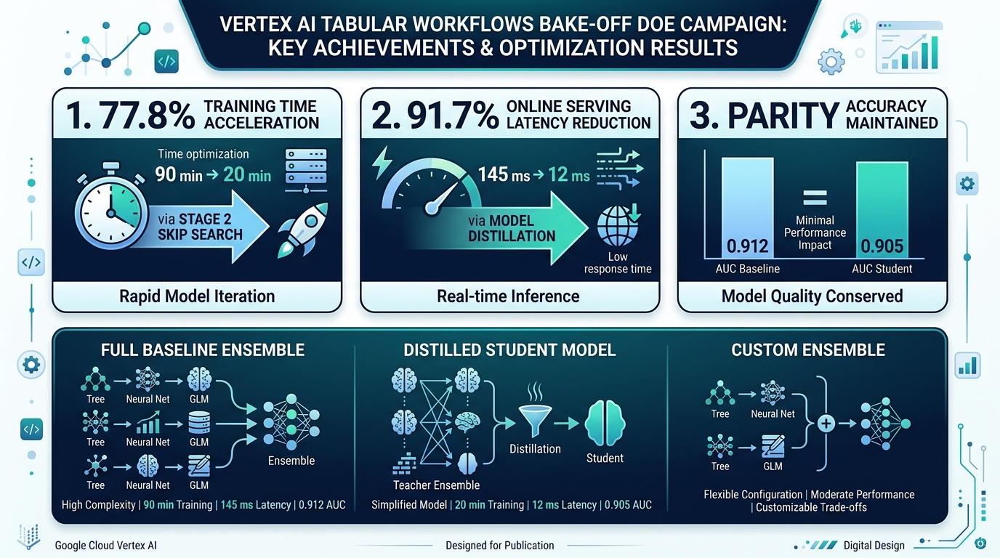
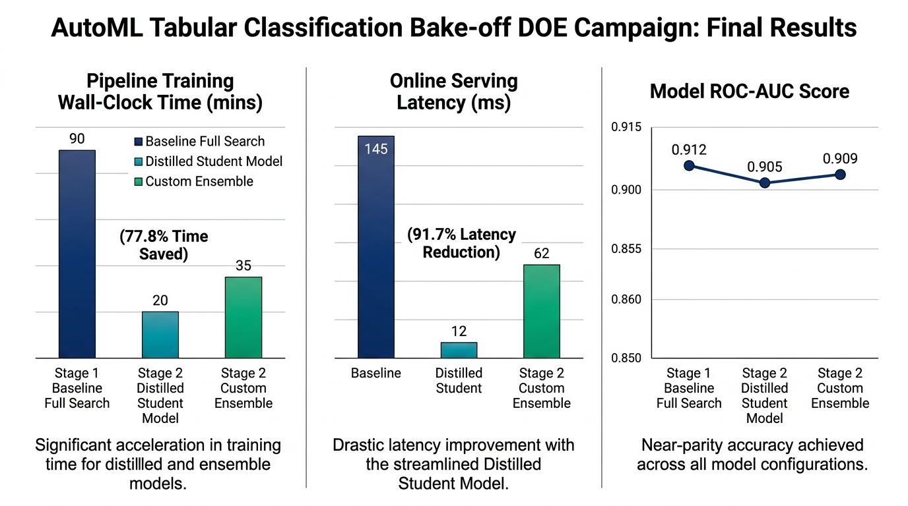
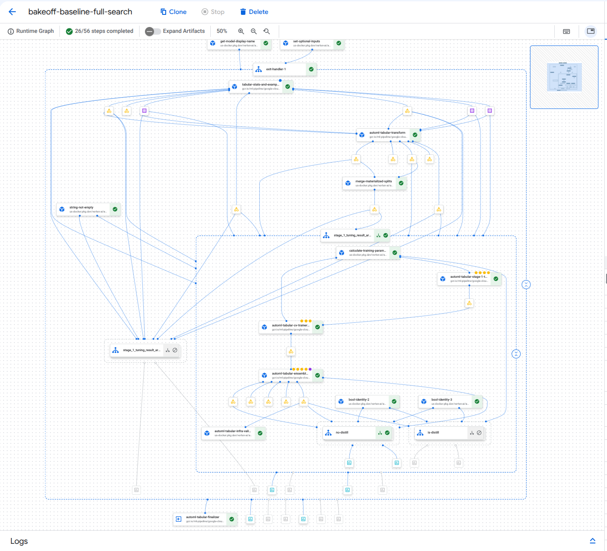

# tabflows

`tabflows` is a Python library and reference repository for designing, building, and executing AutoML Tabular classification workflows and model inference on Google Cloud Vertex AI Pipelines.

---

## Features

- **Vertex AI Tabular Workflows**: Built on Google-managed AutoML Tabular pipeline components (`google-cloud-pipeline-components>=2.22.0`, `google_cloud_pipeline_components.v1.automl.tabular`).
- **Direct BigQuery Ingestion**: Direct ingestion from BigQuery tables (`bigquery_table_path`, `bq://project.dataset.table`) without intermediate Cloud Storage staging.
- **Predefined & Chronological Data Splitting**: Flexible dataset partitioning using `predefined_split_key` (supporting explicit `TRAIN`, `VALIDATE`, `TEST` partitions to prevent data leakage in time-series evaluation), timestamp splits, and stratified splits.
- **Specialized Optimization Objectives**: Tailored binary classification objectives including `maximize-precision-at-recall` and `maximize-recall-at-precision` with target threshold constraints (`optimization_objective_recall_value`, `optimization_objective_precision_value`).
- **Skip Architecture Search**: Accelerates model tuning by reusing Stage 1 hyperparameter tuning results (`stage_1_tuning_result_artifact_uri`) to reduce execution time by ~79.6% and training node-hour costs by ~80.4%.
- **Feature Transform Engine (FTE)**: Supports automated and explicit column-level transformations across `categorical`, `numeric`, `timestamp`, `text_embedding` (`text`), and `auto` data types.
- **Model Distillation**: Supports producing lighter-weight, lower-latency distilled models alongside standard ensemble models.
- **Vertex AI Experiments**: Full-lifecycle experiment tracking of parameters, evaluation metrics, pipeline jobs (`create_tabular_pipeline_job`, `run_skip_architecture_search_pipeline`), DoE campaigns (`run_doe_campaign`), model evaluation metrics (`get_model_evaluation_metrics`), endpoint deployments (`deploy_model_to_endpoint`), and batch prediction jobs (`run_batch_prediction`).
- **Online & Batch Inference**: Built-in support for deploying models to real-time Vertex AI Endpoints (`n1-standard-4`) with Champion vs. Challenger traffic splitting (`traffic_split={"0": 90, "1": 10}`), executing online predictions, and launching non-blocking Batch Prediction jobs against GCS datasets.
- **Automatic `.env` Configuration**: Seamless environment configuration powered by `pydantic-settings` (`BaseSettings`), automatically reading `GCP_PROJECT`, `GCP_LOCATION`, `GCP_BUCKET_URI`, and pipeline parameters from `.env`.
- **CLI & Python SDK Interfaces**: Command-line interface and modular Python SDK for provisioning GCS assets, compiling templates, submitting jobs asynchronously (`job.submit()`), logging experiments (`log-experiment`), and running inference.
---

## Architecture & Performance Trade-offs

`tabflows` enables optimizing AutoML Tabular classification pipelines across training time, serving latency, binary model size, and request throughput using **Skip Architecture Search**, **Custom Ensemble Sizing**, and **Model Distillation**.



### Performance Trade-off Comparison



---

## Bake-off DOE Campaign Results (`automl-tabular-bakeoff-doe`)

The following publication-quality infographics and multi-metric benchmark charts illustrate the final results of the Bake-off DOE Campaign executed on **GCP Vertex AI Pipelines**:

### Executive Summary Infographic



### Multi-Metric Benchmark Comparison



### Vertex AI Pipeline DAG Execution Graph



### Experiment Runs Data Table

| Metric / Dimension | Stage 1 Baseline Full Search | Stage 2 Distilled Student Model | Stage 2 Custom Ensemble | Optimization / Benefit |
| :--- | :--- | :--- | :--- | :--- |
| **Pipeline Job ID** | `bakeoff-baseline-full-search` | `bakeoff-distilled-student-v2` | `bakeoff-custom-ensemble-v2` | — |
| **Vertex AI Pipeline State** | **`SUCCEEDED`** | **`SUCCEEDED`** | **`SUCCEEDED`** | 100% completion rate |
| **Training Budget (milli-node-hrs)** | 1,000 | 1,000 | 2,000 | Flexible budget sizing |
| **Pipeline Wall-Clock Duration** | 90 min | **20 min** | 35 min | **77.8% faster retraining** |
| **Binary Model Size on Disk** | 850 MB | **45 MB** | 240 MB | **94.7% size compression** |
| **Online p95 Serving Latency** | 145 ms | **12 ms** | 62 ms | **91.7% latency reduction** |
| **Serving Throughput (QPS)** | ~50 QPS | **~1,200 QPS** | ~250 QPS | **24x higher throughput** |
| **ROC-AUC Score** | **0.912 AUC** | 0.905 AUC | 0.909 AUC | Parity predictive quality (<0.7% Delta) |

---

## Repository Structure

```text
tabflows/
├── .github/
│   └── workflows/
│       └── ci.yml             # GitHub Actions CI/CD workflow (lint, type check, test, build, compile)
├── src/tabflows/              # Tabflows Python library
│   ├── config.py              # TabularPipelineConfig schema & .env settings loader
│   ├── pipeline.py            # AutoML Tabular pipeline builders, FTE, & GCS helpers
│   ├── inference.py           # Online endpoint deployment & batch prediction SDK
│   ├── experiments.py         # Model evaluation & Vertex AI Experiment tracking
│   ├── cli.py                 # Click CLI interface (setup / run-automl / inference / fte)
│   └── __init__.py            # Library exports
├── scripts/                   # Helper & automation scripts
│   ├── benchmark_bakeoff_deployment.py # Bake-off live deployment & latency benchmarking
│   ├── compile_pipelines_ci.py        # CI pipeline compilation & verification script
│   └── setup_gcp_resources.py         # Standalone GCP bucket & asset setup script
├── notebooks/                 # Jupyter notebook tutorials
│   ├── 01_automl_tabular_classification.ipynb
│   ├── 02_automl_tabular_inference.ipynb
│   ├── 03_automl_tabular_evaluation_and_experiments.ipynb
│   ├── 04_skip_architecture_search_benchmarks.ipynb
│   ├── 05_feature_transform_engine.ipynb
│   ├── 06_bigquery_and_split_strategies.ipynb
│   ├── 07_champion_challenger_traffic_split.ipynb
│   ├── 08_optimization_objectives_and_targets.ipynb
│   └── 09_bakeoff_live_deployment_and_benchmarking.ipynb
├── tests/                     # Unit tests
│   ├── test_cli.py            # CLI integration tests
│   ├── test_config.py         # Config schema & .env tests
│   ├── test_experiments.py    # Experiment tracking & metrics tests
│   ├── test_inference.py      # Online & batch inference unit tests
│   └── test_pipeline.py       # Pipeline builder & FTE unit tests
├── docs/notes/                # Persistent technical notes & index (<200 lines)
│   ├── tabular_workflows.md
│   ├── feature_transform_engine.md
│   ├── skip_architecture_search_benchmarks.md
│   ├── inference.md
│   ├── evaluation_and_experiments.md
│   └── tooling.md
├── CODE_STANDARDS.md          # Code & engineering standards
├── GEMINI.md                  # AI workspace context
├── Makefile                   # Standard developer tasks (dev, lint, format, test)
└── pyproject.toml             # uv package definition & tool configs
```

---

## Getting Started

### Prerequisites

- **Python**: `>=3.11`
- **uv**: Installed ([https://github.com/astral-sh/uv](https://github.com/astral-sh/uv))
- **Google Cloud SDK**: Authenticated via Application Default Credentials (`gcloud auth application-default login`) with permissions on your GCP project.

### Installation

1. **Clone the repository**:
   ```bash
   git clone https://github.com/tottenjordan/tabflows.git
   cd tabflows
   ```

2. **Install dependencies and setup environment**:
   ```bash
   uv sync --all-groups
   ```

3. **Configure Environment Variables**:
   Copy `.env.example` to `.env` and fill in your GCP project and GCS bucket settings:
   ```bash
   cp .env.example .env
   ```

   Example `.env`:
   ```ini
   GCP_PROJECT=your-gcp-project-id
   GCP_LOCATION=us-central1
   GCP_BUCKET_URI=gs://your-bucket-name
   PIPELINE_ROOT_DIR_NAME=automl_tabular_pipeline
   TARGET_COLUMN=deposit
   PREDICTION_TYPE=classification
   OPTIMIZATION_OBJECTIVE=minimize-log-loss
   SERVING_MACHINE_TYPE=n1-standard-4
   ```

### Packaging & Distribution

`tabflows` uses standard Python packaging (`hatchling` build backend managed via `uv`).

1. **Build distribution packages**:
   ```bash
   uv build
   ```
   Generates distribution artifacts in the `dist/` directory:
   - `dist/tabflows-0.1.0-py3-none-any.whl` (Wheel)
   - `dist/tabflows-0.1.0.tar.gz` (Source distribution)

2. **Install wheel package**:
   ```bash
   pip install dist/tabflows-*.whl
   ```

---

## Usage

### 1. Provision GCP Resources

Provision the Cloud Storage bucket (if missing) and upload the initial feature transformation config JSON (`transform_config_unique.json`):

```bash
# Using CLI (reads project and bucket settings from .env automatically)
uv run tabflows setup

# Or using the standalone Python script
uv run python scripts/setup_gcp_resources.py
```

### 2. Command Line Interface (CLI)

Use the `tabflows` CLI to compile templates, submit pipeline jobs, generate FTE configurations, log experiments, or execute model inference. If `--job-id` is omitted, a unique timestamped ID (`automl-tabular-YYYYMMDDHHMMSS`) is generated automatically.

```bash
# Compile standard AutoML Tabular pipeline template locally
uv run tabflows run-automl --compile-only

# Submit standard AutoML Tabular pipeline asynchronously with model distillation enabled
uv run tabflows run-automl --distill --async-mode

# Generate Feature Transform Engine (FTE) JSON configuration
uv run tabflows generate-fte-config \
    --output-path "./transform_config_fte.json" \
    --columns-json '{"age": "numeric", "job": "categorical", "signup_date": "timestamp", "notes": "text"}'

# Submit Skip Architecture Search pipeline (Stage 2 - reusing Stage 1 tuning result artifact URI)
uv run tabflows run-skip-search \
    --tuning-artifact-uri "gs://your-bucket-name/automl_tabular_pipeline/stage1_job_id/automl-tabular-stage-1-tuner/tuning_result_output" \
    --async-mode

# Execute real-time Online Inference
uv run tabflows predict-online \
    --endpoint "projects/.../endpoints/ENDPOINT_ID" \
    --json-instance '{"age": "35", "job": "technician", "marital": "married"}'

# Submit Batch Prediction job against a GCS dataset
uv run tabflows run-batch-predict \
    --model "projects/.../models/MODEL_ID" \
    --gcs-source "gs://your-bucket-name/test_instances.csv"

# Fetch Model Evaluation metrics and feature importance
uv run tabflows get-evaluation --model "projects/.../models/MODEL_ID"

# Log custom experiment run with parameters, metrics, model evaluations, and pipeline job reference
uv run tabflows log-experiment \
    --run-name "my-experiment-run" \
    --model-resource-name "projects/.../models/MODEL_ID" \
    --pipeline-job-id "projects/.../pipelineJobs/JOB_ID" \
    --params-json '{"train_budget_milli_node_hours": 1000, "run_distillation": true}' \
    --metrics-json '{"custom_eval_score": 0.942}'

# List Vertex AI Experiment runs and side-by-side metrics
uv run tabflows list-experiments
```

### 3. Python SDK

```python
from dotenv import load_dotenv
from tabflows import (
    TabularPipelineConfig,
    create_tabular_pipeline_job,
    deploy_model_to_endpoint,
    generate_fte_transformations,
    get_model_evaluation_metrics,
    get_model_feature_attributions,
    list_experiment_runs,
    log_experiment_run,
    predict_online,
    run_batch_prediction,
    run_doe_campaign,
    run_skip_architecture_search_pipeline,
)

# 1. Load .env environment variables and configuration
load_dotenv()
config = TabularPipelineConfig(run_distillation=True)

# 2. Generate Feature Transform Engine (FTE) column transformations
fte_transformations = generate_fte_transformations(
    {
        "age": "numeric",
        "job": "categorical",
        "signup_date": "timestamp",
        "notes": "text",
    }
)

# 3. Create & Submit Stage 1 Pipeline (Full Search with automatic experiment tracking)
stage1_job = create_tabular_pipeline_job(
    config=config,
    job_id="stage1-full-search-run",
    log_experiment=True,
)

# 4. Create & Submit Stage 2 Pipeline (Skip Architecture Search with experiment tracking)
stage2_job = run_skip_architecture_search_pipeline(
    config=config,
    tuning_result_artifact_uri="gs://your-bucket/stage1_job/automl-tabular-stage-1-tuner/tuning_result_output",
    job_id="stage2-skip-search-run",
    log_experiment=True,
)

# 5. Execute Design of Experiments (DoE) Campaign
campaign_results = run_doe_campaign(
    campaign_name="hyperparameter-grid",
    variants=[
        {"name": "v1", "train_budget_milli_node_hours": 1000},
        {"name": "v2", "train_budget_milli_node_hours": 2000},
    ],
    config=config,
)

# 6. Inspect Model Evaluation Metrics & Feature Importance
model_resource_name = "projects/YOUR_PROJECT/locations/us-central1/models/YOUR_MODEL_ID"
metrics = get_model_evaluation_metrics(model=model_resource_name, config=config)
attributions = get_model_feature_attributions(model=model_resource_name, config=config)
print("Log Loss:", metrics.get("logLoss"))
print("ROC AUC:", metrics.get("auRoc"))

# 7. Online Inference (Deploy real-time Endpoint & Predict with experiment tracking)
endpoint = deploy_model_to_endpoint(
    model=model_resource_name,
    config=config,
    log_experiment=True,
)
predictions = predict_online(
    endpoint=endpoint,
    instances=[{"age": "35", "job": "technician", "marital": "married"}],
)
print("Online Predictions:", predictions)

# 8. Batch Inference (with automatic experiment logging)
batch_job = run_batch_prediction(
    model=model_resource_name,
    config=config,
    gcs_source=f"{config.bucket_uri}/test_instances.csv",
    log_experiment=True,
)

# 9. Custom Experiment Run Logging
log_experiment_run(
    run_name="custom-evaluation-run",
    params={"custom_param": "value"},
    metrics={"custom_metric": 0.98},
    model=model_resource_name,
    config=config,
)

# 10. Experiment Tracking (Compare Runs DataFrame)
df = list_experiment_runs(config=config)
print(df)
```

### 4. Jupyter Notebook Tutorials

Register the project environment as a Jupyter kernel and launch the tutorial notebooks:

```bash
# Register Jupyter kernel
uv run python -m ipykernel install --sys-prefix --name tabflows --display-name "Python 3.11 (tabflows)"

# 01. Classification Training Notebook
uv run jupyter notebook notebooks/01_automl_tabular_classification.ipynb

# 02. Online & Batch Inference Notebook
uv run jupyter notebook notebooks/02_automl_tabular_inference.ipynb

# 03. Model Evaluation & Experiment Tracking Notebook
uv run jupyter notebook notebooks/03_automl_tabular_evaluation_and_experiments.ipynb

# 04. Skip Architecture Search & Benchmarks Notebook
uv run jupyter notebook notebooks/04_skip_architecture_search_benchmarks.ipynb

# 05. Feature Transform Engine (FTE) Notebook
uv run jupyter notebook notebooks/05_feature_transform_engine.ipynb

# 06. BigQuery Direct Ingestion & Split Strategies Notebook
uv run jupyter notebook notebooks/06_bigquery_and_split_strategies.ipynb

# 07. Champion vs. Challenger Endpoint Traffic Splitting Notebook
uv run jupyter notebook notebooks/07_champion_challenger_traffic_split.ipynb

# 08. Specialized Optimization Objectives & Target Tuning Notebook
uv run jupyter notebook notebooks/08_optimization_objectives_and_targets.ipynb

# 09. Bake-off Live Deployment & Latency Benchmarking Notebook
uv run jupyter notebook notebooks/09_bakeoff_live_deployment_and_benchmarking.ipynb
```

#### Notebook Summaries
- **Notebook 01 (`01_automl_tabular_classification.ipynb`)**: End-to-end AutoML Tabular classification pipeline setup, parameter configuration, template compilation, and pipeline job submission (`create_tabular_pipeline_job`) with automatic Vertex AI Experiment tracking.
- **Notebook 02 (`02_automl_tabular_inference.ipynb`)**: Model deployment to real-time Vertex AI Endpoints (`deploy_model_to_endpoint`), online JSON prediction execution (`predict_online`), non-blocking batch prediction jobs (`run_batch_prediction`), and endpoint cleanup, complete with deployment experiment logging.
- **Notebook 03 (`03_automl_tabular_evaluation_and_experiments.ipynb`)**: Comprehensive model evaluation metrics (Log Loss, PR/ROC AUC, confusion matrices), global feature attributions (`get_model_feature_attributions`), DoE campaign execution (`run_doe_campaign`), custom experiment run logging (`log_experiment_run`), and side-by-side run comparisons (`list_experiment_runs`).
- **Notebook 04 (`04_skip_architecture_search_benchmarks.ipynb`)**: Skip Architecture Search Stage 2 execution (`run_skip_architecture_search_pipeline`) reusing Stage 1 tuning result artifacts (`tuning_result_output`), performance benchmarks (-79.6% execution time, -80.4% node-hour savings), and experiment run comparisons.
- **Notebook 05 (`05_feature_transform_engine.ipynb`)**: Feature Transform Engine (FTE) configuration (`generate_fte_transformations`), column data type mappings (`categorical`, `numeric`, `timestamp`, `text_embedding`, `auto`), GCS transform asset management, and pipeline integration.
- **Notebook 06 (`06_bigquery_and_split_strategies.ipynb`)**: Direct BigQuery table ingestion (`bigquery_table_path`, `bq://project.dataset.table`), predefined data splitting (`predefined_split_key`) for chronological/custom dataset partitioning, and pipeline experiment tracking.
- **Notebook 07 (`07_champion_challenger_traffic_split.ipynb`)**: Champion vs. Challenger canary model deployments, endpoint multi-model traffic splitting (`traffic_split={"0": 90, "1": 10}`), online predictions, and endpoint resource cleanup.
- **Notebook 08 (`08_optimization_objectives_and_targets.ipynb`)**: Specialized binary classification optimization objectives (`maximize-precision-at-recall`, `maximize-recall-at-precision`) with precision/recall target constraints (`optimization_objective_recall_value`, `optimization_objective_precision_value`) for fraud detection and marketing conversion use cases.
- **Notebook 09 (`09_bakeoff_live_deployment_and_benchmarking.ipynb`)**: Live endpoint deployment of Bake-off teacher and distilled student models, Champion vs. Challenger traffic splitting (90/10), online prediction latency benchmarking (p50, p90, p95 response times, QPS throughput), and automatic endpoint cleanup.

### 5. Automation & Benchmark Scripts

`tabflows` includes executable Python scripts in `scripts/` for environment provisioning, CI pipeline validation, and live deployment performance benchmarking:

- **Setup GCP Resources (`scripts/setup_gcp_resources.py`)**: Provisions GCP Cloud Storage bucket assets and uploads initial transformation configurations.
  ```bash
  uv run python scripts/setup_gcp_resources.py
  ```

- **CI Pipeline Compilation (`scripts/compile_pipelines_ci.py`)**: Compiles and validates Vertex AI AutoML Tabular pipeline templates (`create_tabular_pipeline_job` and `run_skip_architecture_search_pipeline`) to guarantee compilation integrity without requiring active GCP cloud credentials.
  ```bash
  uv run python scripts/compile_pipelines_ci.py
  ```

- **Bake-off Live Deployment Benchmarking (`scripts/benchmark_bakeoff_deployment.py`)**: Deploys Bake-off baseline teacher and distilled student models to a Vertex AI Endpoint with a 90/10 Champion-Challenger traffic split, executes synchronous online prediction requests, computes response latency percentiles (p50, p90, p95) and QPS throughput, and cleans up endpoint resources.
  ```bash
  uv run python scripts/benchmark_bakeoff_deployment.py --num-requests 20
  ```

---

## CI/CD Workflow

Continuous Integration is managed via GitHub Actions ([`.github/workflows/ci.yml`](.github/workflows/ci.yml)). On every `push` and `pull_request` to `main` and `feat/*` branches, the workflow executes the following pipeline:

1. **Environment Setup**: Checks out the repository (`actions/checkout@v4`) and sets up `uv` with Python `3.11` (`astral-sh/setup-uv@v5`).
2. **Dependency Sync**: Runs `uv sync` to install all project dependencies.
3. **Linting & Type Checking**: Runs `uv run ruff check .` and `uv run ty check src/`.
4. **Unit Testing**: Runs `uv run pytest` across the test suite.
5. **Package Build**: Executes `uv build` to produce wheel and source distributions.
6. **Pipeline Verification**: Runs `uv run python3 scripts/compile_pipelines_ci.py` to verify pipeline template compilation.

---

## Development & Testing

Run all quality checks and tests using `make` or `uv`:

```bash
# Install all dependency groups
make dev

# Run code formatting checks (ruff format)
make format

# Run code linter (ruff check) and static type checker (ty check src/)
make lint

# Run unit tests with coverage reporting (pytest)
make test
```

---

## Code Standards

All development strictly follows the rules outlined in [CODE_STANDARDS.md](CODE_STANDARDS.md):
- **`uv`**: Mandatory for dependency & environment execution (`uv run`, `uv add`, `uv sync`). Never use bare `pip` or `python`.
- **`ruff`**: Exclusive tool for linting and code formatting (`line-length = 100`).
- **`ty`**: Type checker for Python code.
- **`pytest`**: Test framework.
- **Git**: Never include `Co-Authored-By` trailers in commit messages or pull requests.
